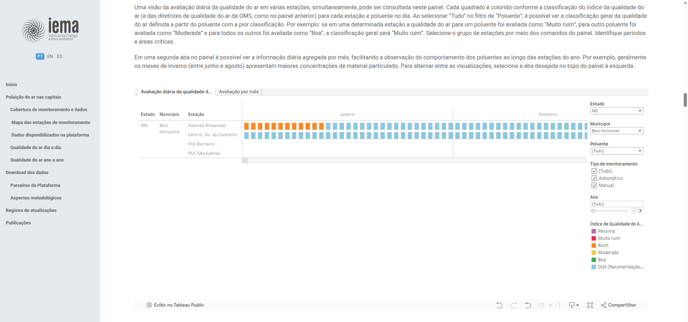
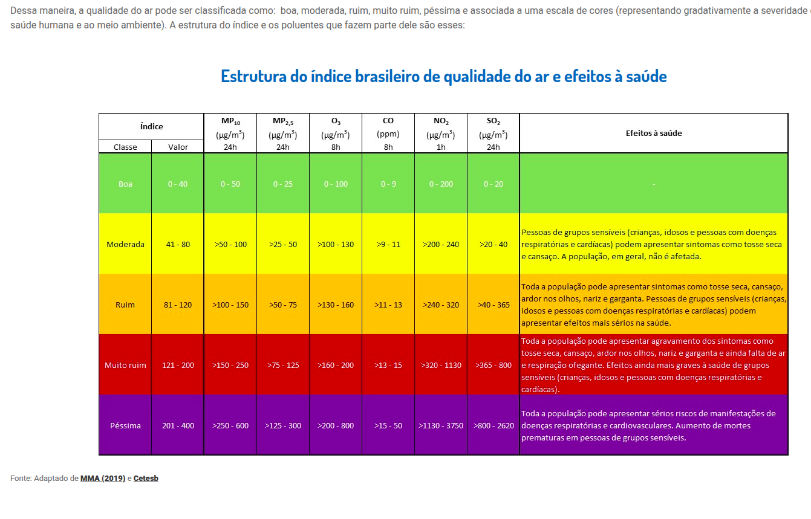
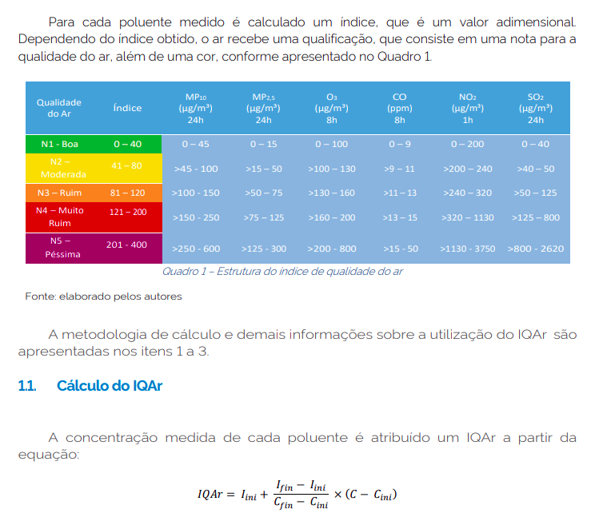

# Air quality data

Download air quality metrics from **IEMA** (Instituto de Energia e Meio Ambiente).

Download from  https://energiaeambiente.org.br/qualidadedoar/ (Screenshots below)

  

---

## Download Raw Data:

Minas Gerais:
  - https://drive.google.com/drive/folders/1WE8KWKfj8fo1IE_7YKUfjxzzCwqtAmjH

São paulo:
  - https://drive.google.com/drive/folders/1S225sgjyNDA-2xTm_uFDr2KxDLu5KrAW

# Air Q. Table

https://energiaeambiente.org.br/qualidadedoar/#sec17

https://www.gov.br/mma/pt-br/assuntos/meio-ambiente-urbano-recursos-hidricos-qualidade-ambiental/qualidade-do-ar/indice-de-qualidade-do-ar-iqar/orientacao-tecnica-indice-de-qualidade-do-ar-jan-25.pdf

